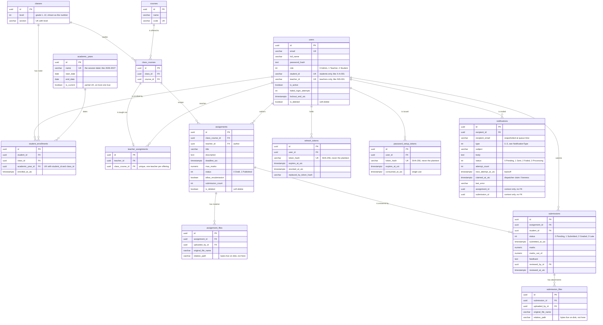

# Assignment & Submission Management System

A role-based assignment and submission system for a school or college — ASP.NET Core Web API
over PostgreSQL, with a Next.js frontend.

**Admins** manage users, academic years, classes, courses, course offerings, enrollments and teacher
assignments, and see everything. **Teachers** create and publish assignments for an offering
they teach, then grade submissions with marks and feedback. **Students** see assignments for
their enrolled classes, hand in their work as files, and read their marks once graded. Six events
queue an email automatically; a new account's mail carries a single-use link to choose a
password, never a password.

[Quick start](#quick-start) · [Features](#features) · [Business rules](#business-rules) ·
[Stack & structure](#technology-stack) · [Data model](#data-model) · [API](#api) ·
[Security](#security) · [Notifications](#notifications) · [Tests](#tests) ·
[Config](#configuration) · [Assumptions](#assumptions) · [Limitations](#known-limitations)

## Quick start

Docker and Docker Compose are the only prerequisites — no .NET SDK, no Node, no local Postgres,
no mail credentials.

```bash
docker compose up --build
```

| Service | URL | |
|---|---|---|
| Frontend | http://localhost:3000 | Sign in with the credentials below |
| API | http://localhost:5080 | Swagger `/swagger`, health `/health` |
| Mailpit | http://localhost:8025 | Every notification email lands here; nothing leaves the machine |
| PostgreSQL | `localhost:5432` | Persisted in the `pgdata` volume |

Migrations and demo data are applied automatically on first boot — **no table needs creating by
hand**. `docker compose down -v` resets to a clean database.

Copy `.env.example` to `.env` and set a real `Jwt__Key` before doing anything beyond a local
demo; every value has a working default otherwise.

### Demo credentials

All seeded accounts share one password.

| Role | Email | Password |
|---|---|---|
| Admin | `admin@assignment.test` | `Password123!` |
| Teacher | `teacher@assignment.test` | `Password123!` |
| Student | `student@assignment.test` | `Password123!` |

The demo teacher is `INS-001`, the school's mathematics and physics master, and every seeded
assignment is theirs. The demo student is `10-A-001` — grade 10, section A — a class the demo
teacher takes for two subjects, so both logins show a populated dashboard at once: draft and
published assignments with real attachments on one side, submitted and marked work on the other.
Also seeded, same password: `teacher2…teacher7@assignment.test`, and
`student1…student40` + `student42…student70@assignment.test` (the 41st seat is the demo login).

### Running manually

Prerequisites: .NET 10 SDK, Node.js 20+, PostgreSQL 17. For the backing services without
installing anything: `docker compose up -d postgres mailpit`.

```bash
cd backend && dotnet restore && dotnet run --project src/AssignmentSystem.Api   # → http://localhost:5269
cd frontend && npm install && npm run dev                                       # → http://localhost:3000
```

The API migrates and seeds on startup here too. Create `frontend/.env.local` with the API's
base origin — no `/api/v1` suffix, the client appends that:

```
NEXT_PUBLIC_API_URL=http://localhost:5269
```

Three differences from Compose when the API runs on the host:

- **Port** is `5269` (`launchSettings.json`), not `5080`. Swagger is mapped in `Development`
  only, which both `dotnet run` and the API container set.
- **Mail** — `Email__Host=mailpit` is a container hostname and will not resolve. Use
  `Email__Host=localhost` with `Email__Port=1025` and `Email__UseSsl=false`, or leave the host
  empty to have notifications logged instead of sent.
- **Uploads** land in `../_uploads` rather than the container's `/data/submissions`.

To manage the schema explicitly instead of auto-migrating, from `backend/`:

```bash
dotnet ef database update --project src/AssignmentSystem.Infrastructure --startup-project src/AssignmentSystem.Api
```

## Features

- **JWT auth** — short-lived access token plus a rotating refresh token in an httpOnly cookie;
  reuse of a rotated token revokes the whole family. Role-based authorization (Admin / Teacher /
  Student) enforced entirely server-side.
- **Authorization as a pipeline, not a convention.** Every command and query declares who may
  send it (`[RequiresRole]` / `[RequiresAuthentication]` / `[AllowAnonymous]`) and one decorator
  enforces all of them. The declaration is mandatory: `AddApplication()` refuses to build the
  container if a message is missing one, so a new endpoint cannot ship unguarded. Rules needing
  the row loaded ("is this *your* assignment?") live in `IAssignmentAccess` / `ISubmissionAccess`.
- **Password setup by single-use link**, never an emailed password — see [Security](#security).
- **Brute-force resistance** — per-IP rate limit on credential endpoints plus a per-account
  lockout, reported indistinguishably from a wrong password.
- **File uploads** on submissions and assignments — extension allow-list, size cap, per-owner
  count cap, magic-byte signature check (the real file header, not the browser's `Content-Type`),
  sanitized filenames, and authorization-checked streaming download (no static file serving).
- **Email notifications** as a transactional outbox with a background dispatcher, exponential
  backoff, and `FOR UPDATE SKIP LOCKED` claims so several API instances never double-send.
- **Pagination, sorting, filtering and search on every list endpoint.** Sort keys are a
  per-endpoint allow-list, each with a unique tiebreaker so paging cannot repeat or skip a row;
  page size is capped at 100 server-side.
- **Charted overviews, aggregated server-side.** Nine charts across the three dashboards — an
  activity trend, submission rate per class, per-assignment progress, the spread of a teacher's
  marking, a student's marks over time and average per course, and part-to-whole bars for
  coursework status and handing in on time. Each series is a grouped read behind one role-scoped
  endpoint, so no screen ships a table of submissions to the browser to count it there. Chart
  colours come from tokens validated per theme for lightness, chroma, contrast and
  protanopia/deuteranopia separation; ordered scales use one hue in steps rather than separate
  hues, so the progression survives colour blindness.
- **Operability** — Serilog (console + daily file), a correlation id on every request and error,
  RFC 7807 ProblemDetails for every failure, Swagger with JWT wired in, `/health` covering the
  database.

Design reasoning lives in XML doc comments next to the code it explains; this README stays at
the level of what the system does and how to run it.

## Business rules

Enforced server-side, and covered by tests.

| | Rule |
|---|---|
| **Visibility** | A student sees only assignments for classes they are enrolled in — read per request, so an admin moving a student takes effect on their next call, not on token expiry. |
| | Drafts are invisible to students; the draft check runs before the enrollment check, so a rejection never leaks which class a hidden assignment belongs to. |
| | A teacher sees only submissions against their own assignments; a student only their own. Passing someone else's id does not widen the result. |
| **Assignments** | Created only by a teacher **assigned to that offering**; updated, deleted, published or graded only by the **author**. |
| | Draft → Published is one-way. Deadline must be at least an hour ahead. Max marks > 0. |
| | Once a published assignment has submissions, only its description may change — the goalposts cannot move under work already handed in. |
| **Submissions** | One per student per assignment (unique DB constraint); resubmitting updates that row. |
| | Must carry at least one file — a submission *is* its attachments, and handing in with nothing attached is refused. |
| | Submitting after the deadline marks it `Late`; late and graded submissions cannot be edited. Editing after the deadline needs `allowResubmission`. |
| | Marks are bounded by the assignment maximum and cannot be negative; feedback ≤ 2000 chars. |
| | A teacher may change a submission's status, except to `Late` — that is derived from the deadline. |
| | Attachments capped per owner (3 per submission, 5 per assignment); removing the last file from a submitted submission is refused. |
| **Organisation** | A class *is* a grade and a section, held apart: the API returns `level` and `section` as two fields and there is no composed name anywhere. A grade holds any number of sections but only one class per section — grade 9 section A cannot exist twice. Grades are numbers, never numerals. |
| | A class studies a course once; an offering has at most one teacher. |
| | An offering cannot be dropped while a teacher or any assignment still references it (`409`, with what to unwind). |
| | A student cannot lose their only class — enrol in the new one first. A student is created together with their first enrollment in one transaction, into the academic year given or the current one. |
| | An enrollment names its academic year. A student sits in a class once **per year**, so repeating a grade is expressible; a year with enrollments against it cannot be deleted, and at most one year is the current session. |
| | Unique emails and course codes; only teachers hold a staff id, only students a student id; a mapping can only name an active teacher. |

## Technology stack

**Backend** — ASP.NET Core 10 / C# · Clean Architecture (Domain / Application / Infrastructure /
Api / Shared) · CQRS dispatcher with a decorator pipeline · EF Core 10 + Npgsql · PostgreSQL 17 ·
FluentValidation · Serilog · Swashbuckle · Mapperly · MailKit · xUnit + FluentAssertions + Moq +
Testcontainers. Warnings are errors, with code style enforced in the build.

**Frontend** — Next.js 16 (App Router) · React 19 · TypeScript · Tailwind CSS 4 · shadcn/ui ·
TanStack Query · React Hook Form + Zod · Axios · Recharts (dashboard charts).

**Database** — PostgreSQL, UUID keys, Fluent API only (no data annotations in the domain), soft
delete via global query filters, optimistic concurrency on every entity through Postgres `xmin`.

```
backend/src/
  AssignmentSystem.Domain/          Entities, value objects, enums — no external dependencies
  AssignmentSystem.Application/     Commands/queries + handlers, validators, DTOs, specifications,
                                    authorization attributes and the decorator pipeline
  AssignmentSystem.Infrastructure/  DbContext, migrations, repositories, JWT, file storage,
                                    SMTP + outbox dispatcher, seeder
  AssignmentSystem.Api/             Controllers, middleware, Swagger, rate limiting, Program.cs
  AssignmentSystem.Shared/          Result<T>/Error, pagination primitives
backend/tests/                      Application.Tests (unit) · Api.Tests (integration)
frontend/src/
  app/                              (auth) login + set-password · (dashboard) role-gated pages
  components/                       ui (shadcn) · layout · shared · features (per-role views)
  context/ hooks/ lib/ schemas/     Session, TanStack Query hooks, Axios client, Zod schemas
  proxy.ts                          Route gate (Next 16's renamed middleware) — cookie presence only
docker-compose.yml                  postgres + mailpit + api + web
```

## Data model

Fourteen tables. Audit columns (`created_at_utc`, `updated_at_utc`, `created_by`, `updated_by`)
and the `xmin` concurrency token exist on all of them and are omitted here; the file tables also
carry `content_type`, `file_size_bytes` and `stored_file_name`.



Two junction tables carry the design:

- **`class_courses` is the course offering** — "this class studies this course" as a real row.
  Teaching mappings and assignments both point at it, so a teacher can never be mapped to a pair
  the class does not study, and an assignment's class and course cannot disagree: one column, not
  two.
- **`student_enrollments` is class membership for one session** — a row per
  (student, class, academic year) rather than a `users.class_id` column, so a student can sit in
  more than one class and the join date is recorded. This is the gate for "a student only sees
  their own classes".

Other decisions:

- **The academic year hangs off the enrollment, not the class** — a cohort outlives a session,
  so grade 9 section A is the same row every year and it is the enrollment that says which
  year a student sat in it. That is what lets one student hold grade 9 for 2025-2026 and grade 10
  for 2026-2027 with both intact, and what makes a repeated grade expressible at all: the same
  (student, class) pair in two years. `academic_years.is_current` carries a partial unique index
  (`WHERE is_current`) so the session the enrollment forms open on can never be ambiguous.
- **`uuid` keys, not `bigint`** — ids travel in URLs and JWTs, so non-enumerable beats compact.
- **`assignments` stores its author directly** and holds no link to the teaching mapping, so
  removing a mapping cannot orphan authorship of work already set.
- **Two file tables, not one polymorphic one** — a teacher owns assignment material, a student
  owns their own attachments; the authorization rules share nothing.
- **`notifications` has no FK to the assignment or submission it mentions** — the outbox must
  outlive what it was about. `recipient_email` is snapshotted for the same reason.
- **Tokens are stored as SHA-256 hashes**, so a database dump cannot be replayed.
- **One `users` table for all roles**, with `student_id` / `teacher_id` unique but nullable —
  Postgres allows many nulls in a unique index, so each constraint binds only its own role.

**Thirteen unique constraints** back the rules above: `users.email`, `users.student_id`,
`users.teacher_id`, `courses.code`, `classes(level, section)`, `academic_years.name`,
`academic_years.is_current` (partial, `WHERE is_current`), `class_courses(class_id, course_id)`,
`teacher_assignments.class_course_id`,
`student_enrollments(student_id, class_id, academic_year_id)`,
`submissions(assignment_id, student_id)`, and the two token hashes.

**Delete behaviour is per relationship**, not left at the default: Cascade where a row is a pure
link or a child (`classes`→offerings, assignment→submissions/files, submission→files, user→
enrollments/tokens/notifications); Restrict where deleting would destroy meaning
(`courses`→offerings, offering→assignments, user→authored assignments,
`academic_years`→enrollments); Set null for historical
attribution (`reviewed_by_id`, `uploaded_by_id`). `users` and `assignments` are soft-deleted in
practice, so the Restrict rules only guard a genuine hard delete. The `notifications` index is
partial — `WHERE status IN (0, 3)` — so the dispatcher's claim query stays proportional to the
backlog rather than to an ever-growing outbox.

### Database and seed data

Schema creation is entirely EF Core migrations (12 of them, under
`Infrastructure/Migrations/`), applied on startup or via `dotnet ef database update`. **No SQL
script needs running by hand.** Two migrations backfill existing data rather than leaving a
valid schema full of empty GUIDs. The offering/enrollment one derives offerings from the
(class, course) pairs in use and copies `users.class_id` into `student_enrollments` before
dropping the column. The academic-year one adds `academic_year_id` nullable, inserts one
session — only where there are enrollments to point at it — flags it current so creating a
student keeps working, backfills every row, and only then sets the column NOT NULL.

`DbSeeder` runs idempotently on startup (skipped once the admin exists) and builds a plausible
secondary school rather than three lonely accounts:

| academic years | classes | courses | offerings | users | enrollments | teaching mappings | assignments | attachments | submissions |
|---|---|---|---|---|---|---|---|---|---|
| 2 (one current) | 14 | 36 | 72 | 78 | 70 | 28 | 24 (8 published, 16 drafts) | 32 on assignments, 40 on submissions | 40 (all graded) |

Grades 6–12 in sections A and B, 5 students each. A subject is a **separate course per grade** —
grade 6 Bangla and grade 11 Bangla are different syllabuses taught to different rooms, and one
row for both would mean one teacher mapping and one assignment list for both. The grade is
encoded in the code, so it is readable without a lookup:

| subject | grades | codes |
|---|---|---|
| Bangla, English | 6–12 | `BAN601`, `ENG601` … `BAN1201`, `ENG1201` |
| General Mathematics, General Science | 6–8 | `GMATH601`, `GSCI601` … `GMATH801`, `GSCI801` |
| Higher Mathematics, Physics, Chemistry, Biology | 9–12 | `HMATH901`, `PHY901` … `BIO1201` |

Every class studies its full subject list, but **only two offerings per section arrive with a
teacher on them** — the other 44 are left blank on purpose, so the admin's teacher-mapping screen
has genuine work waiting rather than a school that is already fully wired. The 7 teachers each
keep to their own subjects rather than being round-robined across whatever is left.

The demo teacher holds 8 of those offerings and each one carries **three assignments — one
published, two still drafts**, so the teacher login shows both halves of the authoring workflow
and the student login sees only what it should. Every assignment carries a **real attachment**
(the published ones carry two: a PDF worksheet and a PNG figure; the drafts a worksheet and a
plain-text instruction sheet), and every published assignment has been **submitted to by all five
students of its class, each with an attachment, and marked with marks and feedback**. So viewing
and downloading an attachment, previewing a PDF, an image and a text file, and reading a grade are
all demonstrable on the first login rather than after an evaluator has done the setup by hand.

The attachments are generated, not checked in: `DemoPdf` and `DemoPng` write the two binary
formats by hand — a real cross-reference table, a real zlib-compressed image — because the upload
policy verifies file signatures, so nothing that merely claimed to be a PDF would survive the same
path an upload takes. `DemoDocumentTests` re-parses both formats independently and puts every
generated file through that policy, which is what keeps "hand-written format" honest.

**No notifications are seeded** — they are a consequence of publishing, submitting or grading, and
a manufactured backlog would mean a fresh checkout emailing seventy fictional addresses on
startup. Publish an assignment to watch the outbox fill.

## API

Base path `api/v1`; Swagger (`/swagger`) is the live contract. Successes are
`{ success, data, message }` plus a `pagination` block on lists; failures are RFC 7807
ProblemDetails carrying a `code` and the request's `traceId`. Every list endpoint takes
`page`, `pageSize`, `search`, `sortBy`, `sortDir` and its own filters.

Where the role says *Any*, the handler narrows the result to what that caller may see rather
than returning everything.

| Area | Endpoints | Role |
|---|---|---|
| Auth | `POST login` · `POST refresh` · `POST logout` · `GET`/`POST set-password` | Anonymous |
| | `GET me` | Any |
| Users | `GET`/`POST /users` · `GET`/`PUT`/`DELETE /users/{id}` | Admin (delete is soft) |
| Academic years, Classes, Courses | `GET` list and by id | Any |
| | `POST` · `PUT` · `DELETE` | Admin (a year with enrollments cannot be deleted) |
| Offerings | `GET /class-courses` | Admin, Teacher |
| | `POST` · `DELETE` | Admin (delete refused while in use) |
| Teaching mappings | `GET /teacher-assignments` | Admin, Teacher |
| | `POST` · `DELETE` | Admin |
| Enrollments | `GET /enrollments` | Admin, Teacher (scoped to taught classes) |
| | `POST` · `DELETE` | Admin (never the last class) |
| | `GET /enrollments/me/courses` | Student |
| Assignments | `GET` list and by id | Any (students: published, own classes) |
| | `POST` · `PUT` · `DELETE` · `POST {id}/publish` | Teacher (author; author from token) |
| | `POST {id}/attachments/upload` · `PUT attachments/{id}` · `DELETE attachments/{id}` | Teacher (author; `PUT` renames, extension fixed) |
| | `GET attachments/{id}` | Any (authorized stream) |
| Submissions | `GET` list and by id | Any (own / own assignments / all) |
| | `POST assignments/{id}/submissions` · `PUT {id}` · `upload` · `PUT files/{id}` · `DELETE files/{id}` | Student (owner; rename closes when the submission does) |
| | `GET assignments/{id}/submissions/me` | Student |
| | `POST {id}/review` | Teacher (author of the assignment) |
| | `GET files/{id}` | Any (as reachable as its submission) |
| Notifications | `GET /notifications` | Any (non-admins scoped to their own mail) |
| | `GET summary` · `POST {id}/retry` · `POST dispatch` | Admin |
| Dashboard | `GET /dashboard/admin` · `GET /dashboard/teacher` · `GET /dashboard/student` | One role each — not one shape per caller |
| Health | `GET /health` | Anonymous |

The dashboard endpoints answer with the series behind the overview charts, already grouped:
activity per day, the draft/published split and each class's submission rate for an admin;
per-assignment progress, marking throughput and the spread of marks given for a teacher; marks
over time, the average per course and a timeliness record for a student. They exist because the
tiles above the charts can be counted with `?pageSize=1` and a pagination total but a trend or a
distribution cannot — the alternative is shipping every submission to the browser and grouping
it there. Each is scoped server-side from the token (a teacher's own authored work, a student's
own submissions), so the aggregates cannot include anyone else's. `days` on the two trend
endpoints is clamped to 7–90 rather than rejected.

## Security

**No password is ever emailed.** An admin creating an account cannot hand the password over in
person, and mail is plaintext through relays nobody here operates — a password that has been
emailed should be treated as public. So the welcome mail carries a **single-use link** instead:

1. The user, a `PasswordSetupToken` and the notification are written in one transaction, so an
   account can never exist with no way for its owner to reach it.
2. Only the token's SHA-256 hash is stored; the plaintext exists in that email and nowhere else.
3. `/set-password?token=…` validates the link with `GET /auth/set-password` **before** showing
   the form, so a dead link says so rather than being discovered after typing a password twice.
4. `POST /auth/set-password` sets the password, marks the token consumed, and revokes every
   refresh token the account held — the account has just changed hands.

Both endpoints are anonymous by necessity, with possession of the token as the authorisation, and
every rejection returns the same error (unknown, expired, spent, deactivated alike) so nobody can
tell "not a token" from "a real token, already used". Lifetime is
`Auth__PasswordSetupTokenHours` (48); the link is built from `Email__AppBaseUrl`. The route gate
deliberately lets a signed-in browser reach `/set-password` — the link belongs to whoever's
mailbox it arrived in, not to whichever cookie is in that browser.

**Sign-in has two independent defences**, because neither covers the other's gap.

| Defence | Setting | Default | Stops |
|---|---|---|---|
| Per-IP rate limit on credential endpoints | `RateLimiting__CredentialsPerMinute` | `10` | One caller working through a wordlist. `429` with `Retry-After`, refused rather than queued. |
| Per-account lockout | `Auth__MaxFailedLoginAttempts` / `Auth__LockoutMinutes` | `5` / `15` | A distributed guess, which slips under any per-IP limit but still lands on one account. |

While locked the password is not even checked, so the account cannot be used as an oracle, and a
lockout returns the same `401 Auth.InvalidCredentials` as a wrong password — saying "locked"
would confirm the address exists and reveal when to return. A successful sign-in, or redeeming a
setup link, clears the counter. Nothing but the credential endpoints is rate limited; a classroom
reading assignment lists should not be throttled.

## Notifications

Six events send mail, each queued by the handler that performs the change, in the same
transaction. Nothing is triggered by hand.

| Event | Recipient |
| --- | --- |
| An account is created | its owner, with a link to set a password |
| A teacher is assigned to an offering | that teacher |
| A student is enrolled in a class | that student (one mail listing the class's courses) |
| An assignment is published | every student enrolled in its class |
| A submission is received | the teacher who owns the assignment |
| A submission is graded | the student who owns it |

Moving a submission back to `Pending` for re-evaluation sends nothing — that is bookkeeping, and
mailing it would announce marks that were just withdrawn.

**Why an outbox rather than sending inline.** The row is committed with the change that caused
it; `NotificationDispatcher` sweeps every `Email__DispatchIntervalSeconds` and sends afterwards.
A slow or misconfigured SMTP server therefore cannot fail the publish, submit or grade that
triggered it; nothing is silently lost when one does; retries are bounded
(`Email__MaxDeliveryAttempts`) with the failure reason kept on the row; and tests assert on rows
instead of intercepting mail.

- **Retries back off** exponentially from `Email__RetryBackoffSeconds`, so an unreachable server
  is not hit once per sweep until the attempt budget is gone.
- **Sweeps claim their work** with `FOR UPDATE SKIP LOCKED`, so concurrent dispatchers take
  disjoint batches and several API instances mail each notification once. Rows stranded by a
  dispatcher that died are reclaimed after `Email__ClaimTimeoutSeconds`. One bad address does not
  block the queue behind it. A retry can duplicate a mail accepted just before a crash — the
  right trade: a notice arriving twice is a nuisance, never arriving is a missed deadline.
- **Three working configurations:** Mailpit (the Compose default — a real SMTP handshake, readable
  at http://localhost:8025, nothing leaving the machine); a real provider (set `Host`, `Port`,
  `UseSsl` and `FromAddress` together; Gmail needs an App Password); or **`Email__Host` empty**,
  where notifications are still queued and their full contents written to the log. Nothing
  silently does nothing.

**Admin → Notifications** exposes the outbox: pending/sent/failed counts, each message's subject
and body, the error behind any failure, a *Send queued now* button, and a retry on exhausted
rows. Teachers and students can read the same endpoint, scoped server-side to their own mail.

## Tests

```bash
cd backend && dotnet test
```

**347 tests, all passing.**

| Project | Tests | Covers |
|---|---|---|
| `Application.Tests` | 123 | Domain invariants (assignment lifecycle, submission state machine, marks bounds, outbox backoff), handlers with mocked repositories, the authorization pipeline, the upload policy, and the seeder's generated attachments — each PDF's cross-reference table and each PNG's chunk CRCs re-parsed independently, then put through the app's own upload validation. No external dependencies. |
| `Api.Tests` | 224 | End-to-end via `WebApplicationFactory` against a **real Postgres container** (Testcontainers): per-endpoint authorization, the submit → grade workflow, enrollment and offering rules, DB constraints, login throttling, rate limiting, password setup, paging/sorting determinism, request hardening, outbox behaviour including concurrent claims, the dashboard aggregates (that a teacher's chart excludes another teacher's work, that a student's averages exclude a classmate's marks, that a progress bar's segments sum to the class roster, and that the trend window is dense and clamped), and the shape of the seeded school — including that every seeded attachment's bytes are readable from storage and are the file its row claims. |

`dotnet test tests/AssignmentSystem.Application.Tests` runs the fast half with no Docker. The
integration project **needs Docker running** — Testcontainers starts and disposes the database
itself. Frontend: `npm run lint` (no automated frontend tests — see
[Limitations](#known-limitations)).

## Configuration

Every setting is an ASP.NET Core configuration key, so it works from `appsettings.json` or an
environment variable with `__` for nesting. `.env.example` documents all of them; copy it to
`.env` for Compose. **No real secret is committed** — `Jwt__Key` ships as an obvious placeholder
and mail credentials are blank.

| Key | Default | Purpose |
|---|---|---|
| `ConnectionStrings__Default` | local Postgres | EF Core connection string |
| `Jwt__Key` | placeholder — **change it** | HMAC signing key, ≥ 32 characters |
| `Jwt__AccessTokenMinutes` / `RefreshTokenDays` | `5` / `7` | Token lifetimes |
| `Cors__Origins__0` | `http://localhost:3000` | Allowed frontend origins |
| `Auth__PasswordSetupTokenHours` / `MinimumPasswordLength` | `48` / `6` | Setup link validity, password floor |
| `Auth__MaxFailedLoginAttempts` / `LockoutMinutes` | `5` / `15` | Per-account lockout |
| `RateLimiting__CredentialsPerMinute` | `10` | Per-IP cap on credential endpoints |
| `FileStorage__Root` | `../_uploads` (`/data/submissions` in Docker) | Where uploaded bytes live |
| `FileStorage__MaxBytes` | 2 MB | Per-file cap; also drives the multipart body limit |
| `FileStorage__MaxFilesPerSubmission` / `MaxFilesPerAssignment` | `3` / `5` | Attachment counts |
| `FileStorage__AllowedExtensions__*` | pdf, docx, doc, txt, png, jpg, jpeg | Only types whose signature can be verified |
| `Email__Host` / `Port` / `UseSsl` / `Username` / `Password` | Mailpit in Docker, empty otherwise | SMTP; empty host logs instead of sending |
| `Email__FromAddress` / `FromName` / `AppBaseUrl` | see `.env.example` | Sender identity, and the base for links in mail |
| `Email__EnableDispatcher` / `DispatchIntervalSeconds` / `BatchSize` | `true` / `30` / `25` | Background sweep |
| `Email__MaxDeliveryAttempts` / `RetryBackoffSeconds` / `ClaimTimeoutSeconds` | `3` / `30` / `300` | Retry budget, backoff base, reclaim window |
| `Database__AutoMigrate` / `SeedOnStartup` | `true` / `true` | Migrate and seed on boot |
| `NEXT_PUBLIC_API_URL` | `http://localhost:5269` | Frontend → API base origin (no `/api/v1`) |

## Assumptions

Recorded where the requirements were not explicit.

1. **PostgreSQL over MongoDB** — the domain is highly relational, with cascade rules and ten
   unique constraints a relational schema enforces naturally.
2. **Class and Course are separate, joined by a `ClassCourse` offering** — "class/course" is two
   things: the cohort, and the subject taught to it.
3. **A student may be enrolled in more than one class** — membership is a row, not a column.
4. **One submission per student per assignment**, updated in place until the deadline, gated by
   the assignment's `AllowResubmission`.
5. **Only a teacher creates an assignment, always as its author** — the id comes from the token,
   never the body, so authorship cannot be spoofed and no assignment can exist that its author
   may not publish or grade. Admins have full visibility but do not author work for teachers.
6. **One teacher per offering.** Co-teaching would mean relaxing a single unique index; nothing
   else in the authorization model depends on it.
7. **Notifications are email-only, with delivery state visible to admins** — an outbox rather
   than fire-and-forget, exposing failures instead of burying them in logs.
8. **Soft delete only for `Assignment` and `User`** — both are referenced by history that must
   stay intact. Everything else hard-deletes under the rules above.
9. **Refresh tokens are included** though not required: a browser needs sessions longer than a
   five-minute access token safely allows.
10. **Custom identity, not ASP.NET Core Identity** — one `ApplicationUser` discriminated by a
    `Role` enum, to keep the model explicit and the schema legible.
11. **Self-registration is disabled** — a closed, admin-provisioned system.
12. **A submission is its attachments** — students hand in files, never prose, so there is no
    student-authored markup in the database at all. Bytes go to disk behind `IFileStorage`, only
    metadata to the database.
13. **Marks are `numeric(5,2)`**, rounded at the domain boundary so the stored and validated
    values cannot disagree.
14. **Single school, no multi-tenancy.** **All timestamps are UTC.**

## Known limitations

- **No virus scanning on uploads.** Extension, size and magic-byte checks only.
- **Notifications only react to state changes.** No deadline reminders (that needs a scheduled
  job), no in-app notification centre for end users, and no mail when access is *withdrawn* —
  un-enrolling a student or removing a teacher's mapping is silent.
- **No forgot-password flow and no way to re-send a setup link.** The token machinery would serve
  both, but nothing issues a token outside account creation, so an expired link means an admin
  sets the password directly.
- **The setup token rides in a query string,** so it can reach a proxy log. Mitigated by being
  single-use and short-lived, not eliminated; the password itself only ever goes in a POST body.
- **No localisation**, and no branding in mail — bodies are HTML built in code with a derived
  plain-text part.
- **No plagiarism detection.**
- **Reference-data lookups are unpaged.** List screens page properly, but dropdowns that need a
  whole catalogue fetch the first 100–200 rows. Fine at this volume; a large school would want a
  searchable async select.
- **Multi-class enrollment is thinly surfaced.** Schema, API and rules all support it; the UI
  shows the classes joined but has no dedicated screen.
- **The outbox is never pruned.** A real deployment would archive past a retention window.
- **No frontend test suite and no CI pipeline** — the testing effort went into backend
  business-rule, authorization and workflow coverage; `dotnet test` and `npm run lint` run
  locally.
- **Local file storage only.** `IFileStorage` exists so S3/Azure Blob could be dropped in; that
  swap is not implemented — and it is what still pins the API to one machine, since the outbox
  already claims rows with `SKIP LOCKED` and sessions hold no server-side state.
- **Rate limiting is per-instance and in memory,** so N replicas multiply the effective limit.
  The per-account lockout is in the database and unaffected; Redis would be the fix.
- **Single-region demo topology** — Docker Compose, no managed Postgres, no HTTPS termination.
