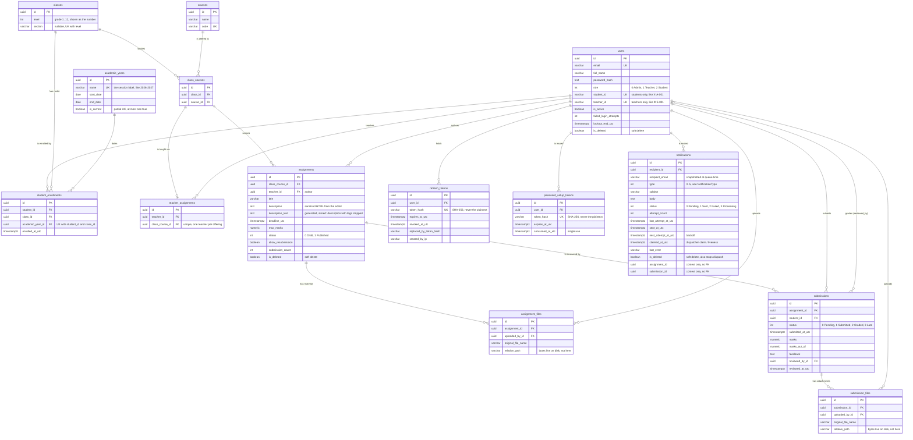

# Assignment & Submission Management System

A role-based assignment and submission platform for a school and college — **ASP.NET Core 10 Web API + PostgreSQL 17 + Next.js 16**, deployed on **AWS EC2** behind Caddy with automatic HTTPS.

**Admins** provision users, academic years, classes, courses, course offerings, enrollments and teaching mappings. **Teachers** author assignments for offerings they teach, publish them, and grade submissions. **Students** see only their enrolled classes' published work, hand in files, and read their marks. Six domain events queue email automatically; a new account is mailed a single-use link to choose a password — never a password.

---

## Live demo (AWS EC2)

| | |
|---|---|
| **App** | **https://35.154.209.160.sslip.io** |
| **API** | `https://35.154.209.160.sslip.io/api/v1` · health [`/health`](https://35.154.209.160.sslip.io/health) |
| **Swagger** | **https://35.154.209.160.sslip.io/swagger/index.html** · [OpenAPI JSON](https://35.154.209.160.sslip.io/swagger/v1/swagger.json) |

### Demo credentials

| Role | Email | Password |
|---|---|---|
| **Admin** | `admin@assignment.test` | `Password123!` |
| **Teacher** | `teacher@assignment.test` | `Password123!` |
| **Student** | `student@assignment.test` | `Password123!` |

The same three accounts are created by the seeder locally, so they work against a fresh `docker compose up` too. The database is seeded with a plausible school — 14 classes, 36 courses, 78 users, 24 assignments (published + drafts) with real attachments, and 40 graded submissions — so every screen is populated on first login.

---

## Contents

[Features](#features) · [Technology stack](#technology-stack) · [Run locally](#run-locally) · [Database setup](#database-setup) · [Environment configuration](#environment-configuration) · [Running the tests](#running-the-tests) · [Project structure](#project-structure) · [Architecture](#architecture) · [Data model](#data-model) · [Business rules](#business-rules) · [API surface](#api-surface) · [Engineering decisions](#engineering-decisions-worth-a-look) · [Notifications](#notifications) · [Deployment](#deployment-aws-ec2) · [Assumptions & known limits](#assumptions--known-limits)

---

## Features

### Admin

- **Manage users** — create Admin / Teacher / Student accounts, edit, activate/deactivate, soft-delete. Student and teacher identifiers (`X-A-001`, `INS-001`) are generated, not typed.
- **Manage academic years, classes and courses** — a class is a grade + section; a course is a catalogue entry with a unique code. Exactly one academic year can be current, enforced by a partial unique index.
- **Manage course offerings** — declare which class studies which course (`class_courses`). This single row is what every assignment and teaching mapping points at.
- **Assign teachers to offerings** — at most one teacher per offering, enforced by a unique index rather than by convention.
- **Enroll students** — a student sits in a class once per academic year, so repeating a grade is expressible.
- **View all assignments and submissions** across every class, unscoped.
- **Application-level settings** — the notification outbox is administrable: pending/sent/failed counts, each message body, the error behind any failure, and a retry.

### Teacher

- **Create, update and delete assignments** — only for offerings they are mapped to, and only their own once created.
- **Assign to a specific class and course at once** — the offering is one column, so an assignment's class and course can never disagree.
- **Define title, description, deadline and maximum marks** — the description is a rich-text editor, sanitized server-side to an allowlist.
- **Publish or keep as draft** — publishing is one-way and mails every enrolled student.
- **Attach material** to an assignment, downloadable by the students who can see it.
- **View student submissions** for their own assignments, with the roster of who has not submitted.
- **Assign marks and provide feedback** — marks are validated against the assignment's maximum.
- **Change submission status when necessary** — including moving a graded submission back to `Pending` for re-evaluation.

### Student

- **View assignments assigned to their class** — published only; drafts are invisible, not merely hidden.
- **View assignment details and deadline**, with a live indication of time remaining and lateness.
- **Submit an answer** as one or more file attachments.
- **Update a submission before the deadline**, when the teacher allowed resubmission.
- **View submission status, marks and teacher feedback**.

### Across all roles

- **Role-scoped dashboards** — nine charts behind three endpoints, aggregated in the database, never by shipping rows to the browser to count them.
- **Search, filtering, sorting and pagination** on every list endpoint, with a server-side allow-list of sort keys and a page-size cap.
- **Automatic email** on six domain events, through a transactional outbox.
- **Responsive UI** with a light/dark theme, client-side validation mirroring the server's rules, and toast-level error reporting.

---

## Technology stack

| Layer | Choice |
|---|---|
| **Frontend** | Next.js 16 (App Router) · React 19 · TypeScript 5 · Tailwind CSS 4 + shadcn/Radix · TanStack Query · React Hook Form + **Zod** · Recharts · Tiptap (rich text) · Axios |
| **Backend** | ASP.NET Core 10 Web API · C# · Clean Architecture + hand-rolled CQRS · FluentValidation · Mapperly · Scrutor · Serilog · Swashbuckle (Swagger/OpenAPI) |
| **Database** | PostgreSQL 17 · EF Core 10 (Npgsql) · Fluent API only · 17 migrations |
| **Auth** | JWT bearer + rotating refresh token in an httpOnly cookie · role-based authorization enforced in the application pipeline |
| **Testing** | xUnit · FluentAssertions · Moq · **Testcontainers** (real Postgres for integration tests) |
| **Infrastructure** | Docker + Docker Compose · Caddy (automatic HTTPS) · Mailpit for local mail · AWS EC2 |

ASP.NET Core Identity is **not** used as the identity system — only its `PasswordHasher<T>` is borrowed, behind an `IPasswordHasher` adapter, so the domain keeps a single `ApplicationUser` discriminated by a `Role` enum.

---

## Run locally

Docker is the only prerequisite — no .NET SDK, no Node, no Postgres, no mail account.

```bash
git clone https://github.com/m-akash/assignment-submission-management-system.git
cd assignment-submission-management-system
cp .env.example .env      # every value has a working default
docker compose up --build
```

| | |
|---|---|
| Frontend | http://localhost:3000 |
| API / Swagger | http://localhost:5080/swagger |
| Mailpit (catch-all inbox) | http://localhost:8025 |

Migrations and seed data apply on boot — **no SQL runs by hand**. Log in with any of the [demo credentials](#demo-credentials) above. `docker compose down -v` resets everything.

### Without Docker

Needs **.NET 10 SDK**, **Node 20+** and **PostgreSQL 17** running on `localhost:5432` with database `assignment_system` and user/password `assignments`/`assignments` — or start just the backing services with `docker compose up -d postgres mailpit` and install nothing else.

```bash
cd backend   && dotnet run --project src/AssignmentSystem.Api   # → http://localhost:5269
cd frontend  && npm install && npm run dev                      # → http://localhost:3000
```

Create `frontend/.env.local` with the API's **base origin** — no `/api/v1` suffix, the client appends that itself:

```
NEXT_PUBLIC_API_URL=http://localhost:5269
```

The API still migrates and seeds itself on startup. Three differences from Compose:

- **Port** is `5269` (`launchSettings.json`), not `5080`. Swagger is served in `Development`, which `dotnet run` sets.
- **Mail** — `Email__Host` is blank by default, so notifications are queued and their full contents written to the log instead of being sent. To read them in Mailpit instead, set `Email__Host=localhost`, `Email__Port=1025`, `Email__UseSsl=false` (`mailpit` is a container hostname and will not resolve from the host).
- **Uploads** land in a local `_uploads/` folder rather than the container's `/data/submissions`.

---

## Database setup

**Nothing is created by hand.** On startup the API applies every EF Core migration and then seeds, both idempotently, so a clean Postgres becomes a fully populated school with no SQL, no dump file and no restore step. The two switches are configuration, not code:

| Variable | Default | Effect |
|---|---|---|
| `Database__AutoMigrate` | `true` | Apply pending migrations on boot |
| `Database__SeedOnStartup` | `true` | Seed roles, demo accounts and the demo school |

The seeder is **idempotent**: it short-circuits once the admin account exists, so restarting the API never duplicates rows and never overwrites edits made through the UI. It builds the demo school from [`DemoCurriculum`](backend/src/AssignmentSystem.Infrastructure/Persistence/Seed/DemoCurriculum.cs) — 7 grades × 2 sections = 14 classes, 36 courses, 72 offerings (28 with a teacher mapped, the rest left as real work for the admin screen), 78 users, 24 assignments (8 published, 16 drafts) and 40 graded submissions. Attachments are **genuine files written through `IFileStorage`**, not rows pointing at nothing, so downloading one is demonstrable on a fresh checkout.

To drive the schema explicitly instead, from `backend/`:

```bash
# apply migrations to the configured database
dotnet ef database update --project src/AssignmentSystem.Infrastructure --startup-project src/AssignmentSystem.Api

# generate a plain SQL script for a DBA to review or run by hand
dotnet ef migrations script --idempotent --project src/AssignmentSystem.Infrastructure --startup-project src/AssignmentSystem.Api --output schema.sql

# add a migration after changing an entity
dotnet ef migrations add <Name> --project src/AssignmentSystem.Infrastructure --startup-project src/AssignmentSystem.Api
```

Migration sources live in [`backend/src/AssignmentSystem.Infrastructure/Migrations/`](backend/src/AssignmentSystem.Infrastructure/Migrations/) (17 of them) and the seeder in [`Persistence/Seed/`](backend/src/AssignmentSystem.Infrastructure/Persistence/Seed/). Reset a local database with `docker compose down -v`.

---

## Environment configuration

Every setting is read from environment variables, and [`.env.example`](.env.example) lists all of them with working local defaults and a comment on each. **No real secret is committed** — `.env` is gitignored, and the example's `Jwt__Key`, database password and SMTP credentials are placeholders.

```bash
cp .env.example .env
```

| Group | Variables | Notes |
|---|---|---|
| Database | `POSTGRES_*`, `ConnectionStrings__Default` | |
| JWT | `Jwt__Key`, `Jwt__Issuer`, `Jwt__Audience`, `Jwt__AccessTokenMinutes`, `Jwt__RefreshTokenDays` | **`Jwt__Key` must be replaced** for any real deployment |
| Auth policy | `Auth__MinimumPasswordLength`, `Auth__MaxFailedLoginAttempts`, `Auth__LockoutMinutes`, `Auth__PasswordSetupTokenHours` | |
| Rate limiting | `RateLimiting__CredentialsPerMinute` | Per-IP, on credential endpoints |
| File storage | `FileStorage__Root`, `FileStorage__MaxBytes` (2 MB), `FileStorage__MaxFilesPerSubmission` (3), `FileStorage__AllowedExtensions__*` (`pdf`, `docx`, `doc`, `txt`, `png`, `jpg`, `jpeg`) | |
| Email / outbox | `Email__Host`, `Email__Port`, `Email__UseSsl`, `Email__Username`, `Email__Password`, `Email__From*`, `Email__EnableDispatcher`, `Email__DispatchIntervalSeconds`, `Email__BatchSize`, `Email__MaxDeliveryAttempts`, `Email__RetryBackoffSeconds`, `Email__ClaimTimeoutSeconds`, `Email__AppBaseUrl` | Blank `Email__Host` logs mail instead of sending it |
| Database bootstrap | `Database__AutoMigrate`, `Database__SeedOnStartup` | |
| Hosting | `ASPNETCORE_ENVIRONMENT`, `Cors__Origins__0`, `SITE_HOST`, `Swagger__Enabled` | |
| Frontend | `NEXT_PUBLIC_API_URL` | Base origin only — the client appends `/api/v1` |

---

## Running the tests

**300+ test methods (xUnit)** across two projects. From `backend/`:

```bash
dotnet test                                              # everything
dotnet test tests/AssignmentSystem.Application.Tests     # unit only — no Docker needed
dotnet test tests/AssignmentSystem.Api.Tests             # integration — requires Docker
```

| Project | What it covers | Needs |
|---|---|---|
| **`AssignmentSystem.Application.Tests`** | Domain invariants (assignment publish/edit rules, submission lifecycle, marks validation, academic-year and class rules), handler behaviour, the authorization pipeline, HTML sanitization, and the file-upload policy | nothing external |
| **`AssignmentSystem.Api.Tests`** | End-to-end through `WebApplicationFactory` against a **real Postgres container** (Testcontainers): per-endpoint role authorization, the submit → grade workflow, password-setup redemption, login throttling and rate limiting, DB constraints, outbox concurrency, sorting/filtering/search, and dashboard scoping | **Docker running** |

`Api.Tests` starts and disposes its own Postgres container — there is no database to prepare and nothing to clean up afterwards.

---

## Project structure

```
backend/
  src/
    AssignmentSystem.Domain/          Entities, value objects, enums, domain exceptions —
                                      zero external dependencies
    AssignmentSystem.Application/     Commands/queries + handlers, FluentValidation validators,
                                      DTOs, specifications, authorization attributes,
                                      the dispatcher and its decorator pipeline
    AssignmentSystem.Infrastructure/  EF Core DbContext + 17 migrations + 14 Fluent API
                                      configurations, repositories, JWT, password hashing,
                                      file storage, SMTP outbox dispatcher, seeder
    AssignmentSystem.Api/             Controllers, middleware, Swagger, rate limiting, Serilog
    AssignmentSystem.Shared/          Result<T>/Error, pagination primitives
  tests/
    AssignmentSystem.Application.Tests/   Unit — domain, handlers, authorization, storage policy
    AssignmentSystem.Api.Tests/           Integration — Testcontainers Postgres

frontend/src/
  app/         App Router — (auth) login & set-password · (dashboard) role-gated screens
  components/  ui (shadcn) · layout · shared · feature views per role
  context/     Session
  hooks/       TanStack Query hooks, one per resource
  lib/         Axios client, interceptors, formatting
  schemas/     Zod schemas — the client half of every validated form
  types/       Shared API types
  proxy.ts     Route gate (Next 16's renamed middleware) — cookie presence only

Caddyfile                 Reverse proxy + automatic HTTPS
docker-compose.yml        Local: postgres + mailpit + api + web
docker-compose.prod.yml   EC2: caddy + api + web + postgres
.env.example              Every environment variable, documented
```

---

## Architecture

Clean Architecture with a hand-rolled **CQRS dispatcher**: every request flows `Controller → Dispatcher → [Authorization decorator → Validation decorator] → Handler → Repository`. Handlers return `Result<T>` — no exceptions for business failures, so an expected "you may not do that" never costs a stack unwind and never escapes as a 500.

**Authorization is a pipeline, not a convention.** Roles are gated twice, deliberately. Controllers carry the usual `[Authorize(Roles = "…")]`, but the decision that counts is one layer deeper: every command and query declares who may send it (`[RequiresRole]` / `[RequiresAuthentication]` / `[AllowAnonymous]`), and `AddApplication()` **refuses to build the DI container** if any message lacks a declaration — a new endpoint physically cannot ship unguarded, whatever the controller says. Row-level rules ("is this *your* assignment?", "are you enrolled in that class?") live behind `IAssignmentAccess` / `ISubmissionAccess`, checked in the handler where the row is already in hand.

This is what makes the checklist item *"role-based access is enforced by the backend API"* structural rather than a promise: the frontend's route gate ([`proxy.ts`](frontend/src/proxy.ts)) only checks that a session cookie exists, and is a convenience. Every real decision is made server-side.

---

## Data model

14 tables, UUID keys, Fluent API only, audit columns and Postgres `xmin` optimistic concurrency on every entity, soft delete via global query filters (`users`, `assignments`, `notifications`).

Audit columns (`created_at_utc`, `updated_at_utc`, `created_by`, `updated_by`) and the `xmin` token exist on all 14 tables and are omitted below, as is the `deleted_at_utc` that accompanies every `is_deleted`; the two file tables also carry `content_type`, `file_size_bytes`, `stored_file_name` and `uploaded_at_utc`.



A **class** is a grade + section held apart (never a composed string). A **course offering** (`class_courses`) is the join a class studies once, taught by at most one teacher. An **enrollment** names its academic year, so repeating a grade is expressible. Delete behaviour is set per relationship — Cascade for pure children, Restrict where deleting destroys meaning, Set null for historical attribution.

---

## Business rules

The rules that matter are enforced in the **domain layer** (so no handler can route around one) and covered by tests. Rule identifiers are the ones used in the code's own comments.

| | Rule | Enforced in | Tested in |
|---|---|---|---|
| **B1** | A student may only see and submit to assignments for a class they are enrolled in | `ApplicationUser.IsEnrolledIn` + submission handlers | `AssignmentSubmissionFlowTests`, `AssignmentAuthorizationTests` |
| **B2** | A submission may only be edited before the deadline | `Submission.MarkSubmitted` | `DomainTests/SubmissionTests` |
| **B3** | A teacher manages only their own assignments | `Assignment.IsOwnedBy` + `IAssignmentAccess` | `AssignmentAuthorizationTests`, `AssignmentHandlerTests` |
| **B4 / X1** | Grading requires a published assignment, and marks may not exceed its maximum | `Submission.Grade` | `DomainTests/SubmissionTests`, `AssignmentSubmissionFlowTests` |
| **B6** | Draft → Published is one-way; a published assignment cannot return to draft | `Assignment.Publish` | `DomainTests/AssignmentTests` |
| **B7** | Only the owning teacher may grade or change a submission's status; status may return to `Pending` but never be set to `Late` by hand | `Submission.ChangeStatus` + `ISubmissionAccess` | `DomainTests/SubmissionTests`, `SubmissionFileAuthorizationTests` |
| **X2** | Submitting after the deadline marks the submission `Late`; a `Late` submission cannot be edited | `Submission.Create` / `MarkSubmitted` | `DomainTests/SubmissionTests` |
| **X3** | Nobody may submit to a draft assignment, and students cannot see one at all | Submission handlers + query scoping | `AssignmentSubmissionFlowTests` |
| **X4** | One submission per student per assignment | Unique index `(assignment_id, student_id)` | `PersistenceConstraintTests` |
| **X5** | A deadline must be at least one hour in the future; feedback has a length limit | `Assignment.Create` / `Submission.Grade` | `DomainTests/AssignmentTests` |
| **X6** | Once an assignment has submissions, its metadata is frozen — only the description may be extended | `Assignment.Update` | `DomainTests/AssignmentTests`, `AssignmentHandlerTests` |
| **X8** | Reusing an already-rotated refresh token revokes the entire family | `IJwtTokenService.RotateRefreshTokenAsync` | `AuthSessionTests` |

Alongside these: uploads are capped and signature-checked (`FileUploadPolicyTests`, `SubmissionFileLimitTests`), repeated failed logins lock the account (`LoginThrottlingTests`), a password-setup link is single-use (`PasswordSetupTests`), and every endpoint's role gate is asserted independently (`AuthorizationPipelineTests`).

---

## API surface

REST over `/api/v1`, twelve resource controllers, RFC 7807 `ProblemDetails` on every failure, and a correlation id on every request. Full request/response schemas are in [Swagger](https://35.154.209.160.sslip.io/swagger/index.html).

| Resource | Base route | Endpoints |
|---|---|---|
| Auth | `/api/v1/auth` | `POST login` · `POST refresh` · `POST logout` · `GET me` · `GET`/`POST set-password` (validate, then redeem) |
| Users | `/api/v1/users` | list (search + filter) · get · create · update (also flips active state) · delete |
| Academic years | `/api/v1/academic-years` | CRUD — `isCurrent` is set through create/update, and at most one may hold it |
| Classes | `/api/v1/classes` | CRUD |
| Courses | `/api/v1/courses` | CRUD |
| Class courses | `/api/v1/class-courses` | course offerings — which class studies what |
| Teacher assignments | `/api/v1/teacher-assignments` | teacher ↔ offering mappings |
| Enrollments | `/api/v1/enrollments` | student ↔ class ↔ academic year |
| Assignments | `/api/v1/assignments` | list · get · create · update · `POST {id}/publish` · delete · attachment upload / download / replace / delete |
| Submissions | `/api/v1` | `GET submissions` · `GET submissions/{id}` · `GET assignments/{id}/submissions/me` · `POST assignments/{id}/submissions` · `PUT submissions/{id}` (resubmit) · `POST submissions/{id}/review` (marks, feedback and status in one) · file upload / download / replace / delete |
| Dashboard | `/api/v1/dashboard` | three role-scoped aggregate endpoints |
| Notifications | `/api/v1/notifications` | outbox: list · `GET summary` · `POST {id}/retry` · delete · bulk-delete · `POST dispatch` |
| Health | `/health` | liveness including the database |

Every list endpoint accepts `page`, `pageSize` (capped at 100), a sort key from a per-endpoint allow-list, and resource-appropriate filters.

---

## Engineering decisions worth a look

- **Password setup by single-use link.** User + SHA-256-hashed token + notification are written in **one transaction**, so no account can exist without a way to reach it. Redeeming it revokes every refresh token the account held. Every rejection (unknown / expired / spent / deactivated) returns the same error, so nothing can be used as an account oracle.
- **Two independent brute-force defences.** Per-IP rate limit on credential endpoints (stops one wordlist) plus a per-account DB lockout (stops a distributed spray). A lockout returns the same `401` as a wrong password.
- **Transactional outbox for email.** The notification row commits with the change that caused it; a background dispatcher sends afterwards with exponential backoff and `FOR UPDATE SKIP LOCKED` claims, so a dead SMTP server can never fail a publish/submit/grade, and multiple API instances never double-send. Admins see pending/sent/failed and can retry.
- **File uploads are validated by bytes, not headers** — extension allow-list, size cap, per-owner count cap, **magic-byte signature check**, sanitized names, and authorization-checked streaming download (no static file serving).
- **Rich text that stays searchable.** Descriptions are sanitized to an allowlist on the way in, and `description_text` is a **stored generated column** that strips the tags in the database — so searching for "list" finds briefs about lists, not every brief written as one, and the two columns cannot drift.
- **Deterministic paging.** Sort keys are a per-endpoint allow-list, each with a unique tiebreaker, so paging can never repeat or skip a row; page size capped server-side at 100.
- **Dashboards aggregate server-side.** Nine charts are grouped reads behind three role-scoped endpoints — no screen ships a table of submissions to the browser to count it there.
- **JWT + rotating refresh token** in an httpOnly cookie; reuse of a rotated token revokes the whole family.
- **Operability** — Serilog, correlation id on every request/error, RFC 7807 ProblemDetails everywhere, `/health` covering the database.

---

## Notifications

Real email, sent automatically — nothing is triggered by hand. Six state changes queue a mail in the same transaction that makes the change:

| Event | Recipient |
|---|---|
| Account created | its owner — with the single-use link to set a password |
| Teacher assigned to an offering | that teacher |
| Student enrolled in a class | that student, listing the class's courses |
| Assignment published | every student enrolled in that class |
| Submission received | the teacher who owns the assignment |
| Submission graded | the student who owns it |

Moving a submission back to `Pending` sends nothing — that is bookkeeping, and mailing it would announce marks that were just withdrawn.

The **EC2 deployment sends through a real SMTP provider**, so account-setup links and assignment notices land in the recipient's actual inbox. Locally, Compose points the API at **Mailpit** — a genuine SMTP handshake, every message readable at http://localhost:8025, nothing leaving the machine. With `Email__Host` empty, notifications are still queued and their full contents written to the log; nothing silently does nothing. **Admin → Notifications** exposes the outbox itself: pending/sent/failed counts, each body, the error behind any failure, and a retry.

---

## Deployment (AWS EC2)

Single EC2 instance, four containers on one Docker network. Clone on the host, fill in `.env` (`SITE_HOST`, `Jwt__Key`, DB password, SMTP credentials), and ship:

```bash
git clone https://github.com/m-akash/assignment-submission-management-system.git
cd assignment-submission-management-system && cp .env.example .env && nano .env
docker compose -f docker-compose.prod.yml up -d --build
```

| Container | Role |
|---|---|
| `caddy` | Only public listener (80/443). Terminates TLS with an **auto-provisioned Let's Encrypt certificate**, redirects HTTP → HTTPS, routes `/api/*`, `/health`, `/swagger/*` → API and everything else → Next.js |
| `web` | Next.js standalone build (multi-stage image, non-root, `NEXT_PUBLIC_API_URL` baked at build) |
| `api` | ASP.NET Core, non-root, container `HEALTHCHECK` on `/health`, auto-migrates and seeds on boot |
| `postgres` | Bound to `127.0.0.1` only — never reachable from the internet |

- **HTTPS without a domain**: `SITE_HOST` is an `sslip.io` hostname derived from the instance's public IP (`35.154.209.160` → `35-154-209-160.sslip.io`), which resolves back to that IP and lets Caddy pass the ACME challenge — a real trusted certificate with no DNS registration.
- **State survives redeploys** — Postgres data and uploaded files are host bind mounts (`/data/pgdata`, `/data/submissions`), not container layers.
- **Sized for a small instance** — per-container memory limits keep API + web + Postgres + Caddy inside ~1 GB.
- **Swagger is opt-in outside Development.** It defaults to off in production — the demo above sets `Swagger__Enabled=true` in the host `.env` so evaluators can exercise the API directly. Leave it `false` on anything real: it publishes every route and schema.
- Secrets (`Jwt__Key`, SMTP credentials, DB password) come from the host `.env`; nothing real is committed.

---

## Assumptions & known limits

Where the brief left something open, this is what was assumed:

- **Self-registration is disabled** — a school is a closed system, so accounts are admin-provisioned. A new account is mailed a single-use link to choose its own password; a password is never generated for a user or sent by mail.
- **Custom identity, not ASP.NET Core Identity** — one `ApplicationUser` discriminated by a `Role` enum, since the brief's three roles are fixed and mutually exclusive. Only Identity's password hasher is reused.
- **A class is a grade + section**, and a **course offering** (`class_courses`) is the unit everything hangs off — an assignment names one offering rather than a class and a course separately, so the two can never contradict each other.
- **One teacher per offering.** Co-teaching would be a second row, not a schema change, but it is not modelled.
- **One submission per student per assignment**, updated in place rather than versioned — the brief asks to "update a submission", not to keep a history.
- **A submission *is* its attachments** — students hand in files, not prose, so an empty submission is refused.
- **Resubmission is per-assignment** (`allow_resubmission`), decided by the teacher, and never permitted after the deadline.
- **All timestamps are UTC**, converted at the edge; the system is **single-tenant** (one school).

**Not built:** virus scanning, deadline reminders, self-service forgot-password, plagiarism detection, a frontend test suite, or a CI pipeline. File storage is local disk behind `IFileStorage` (S3 is a drop-in swap) — that, plus in-memory per-instance rate limiting, is what still pins the API to one machine.
